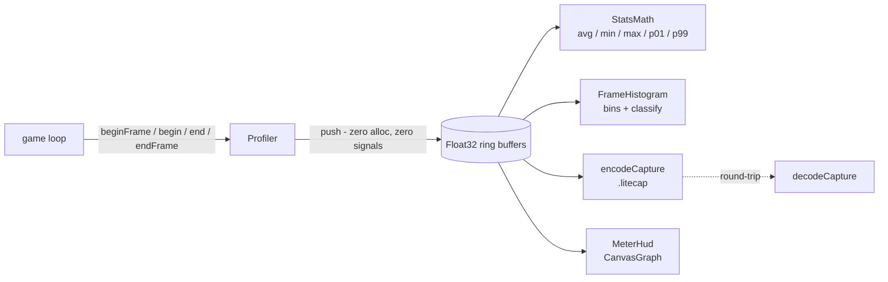
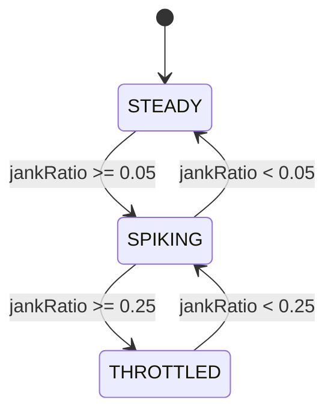

# @zakkster/lite-profiler

[](https://www.npmjs.com/package/@zakkster/lite-profiler)
[](https://github.com/sponsors/PeshoVurtoleta)
[](https://bundlephobia.com/result?p=@zakkster/lite-profiler)
[](https://www.npmjs.com/package/@zakkster/lite-profiler)


[](https://opensource.org/licenses/MIT)

Always-on frame and per-phase profiling for HTML5 game loops. `performance.now()` into power-of-two ring buffers, single-pass percentiles, a frame-time classifier that tells a GC spike apart from a sustained throttle, and a binary capture format you can serialize, ship, and read back.

**The in-engine profiler stats.js doesn't have and DevTools can't keep running.**

> **v1.0.0** is the engine-agnostic, zero-GC capture core. The reactive `lite-signal` bridge, the `lite-scheduler` / `lite-ecs` adapters, and a GPU HUD are companion packages built on this surface (see [Roadmap](#roadmap)).

## Why lite-profiler?

| Capability | lite-profiler | stats.js | DevTools Performance | Phaser built-in | hand-rolled |
|---|---|---|---|---|---|
| **Per-phase (named sub-frame) timing** | **Yes** | No | Manual (User Timing) | No | Manual |
| **Zero-GC hot path** | **Yes** | No | n/a | Partial | Depends |
| **Percentile stats (p50 / p99)** | **Yes** | No | Manual | No | Manual |
| **GC-spike vs throttle classifier** | **Yes** | No | No | No | No |
| **Shareable binary capture + reader** | **Yes (`.litecap`)** | No | Partial (JSON) | No | No |
| **Headless capture (no DOM)** | **Yes** | No | n/a | No | Yes |
| **Worker / OffscreenCanvas HUD** | **Yes** | No | n/a | No | Manual |
| **Framework-agnostic** | **Yes** | Yes | Yes | No (Phaser only) | Yes |
| **TypeScript declarations** | **Yes** | Partial | n/a | Yes | n/a |
| **Reactive (signal) surface** | **Via bridge** | No | No | No | No |

> Chrome DevTools' Performance panel is the right tool for a deep, one-off flame-graph investigation with full call stacks. lite-profiler is for the other job: telemetry that runs every frame, in production, that you can classify and serialize. Different tools, different moments.

## Installation

```bash
npm install @zakkster/lite-profiler
```

ESM only. Requires `@zakkster/lite-ring-buffer`, `@zakkster/lite-stats-math`, and `@zakkster/lite-canvas-graph` at `>= 1.0.1` (the patch that fixes their package `exports` for strict Node ESM resolution). npm pulls them automatically.

## Architecture at a Glance

The hot path is imperative and allocation-free: it does nothing but push `performance.now()` deltas into pre-allocated ring buffers. Everything that reasons about the data — percentiles, the histogram, capture export, the HUD — runs off the hot path, reading from those buffers on your schedule.



## Quick Start

```js
import { Profiler, FrameHistogram, FrameClass } from '@zakkster/lite-profiler';

const profiler = new Profiler(1024, ['input', 'physics', 'render']);
const hist = new FrameHistogram();

function frame() {
  profiler.beginFrame();

  profiler.begin('input');    /* read input */    profiler.end('input');
  profiler.begin('physics');  /* step world */    profiler.end('physics');
  profiler.begin('render');   /* draw */          profiler.end('render');

  profiler.endFrame();
  requestAnimationFrame(frame);
}
requestAnimationFrame(frame);

// Off the hot path (a timer, every N frames, a devtools panel):
hist.update(profiler.frame);
if (hist.classify() === FrameClass.SPIKING) {
  console.warn('intermittent hitches, spikeRatio =', hist.spikeRatio.toFixed(3));
}
```

## Live dashboard demo

`demo/index.html` is a single-file diagnostic dashboard in the oscilloscope theme: a boids flock instrumented across four phases (`spatial`, `steer`, `integrate`, `render`) with the full telemetry surface beside it — the classifier verdict, fps, p50 / p99, a per-phase breakdown, and a live frame-time histogram. Drag the boid count up until frames stay over budget (watch it turn **THROTTLED**); hit **inject GC** to scatter sparse hitches while the phase bars stay calm (**SPIKING** — a pause your code didn't cause). Export the session to `.litecap` from the toolbar.

```bash
npm install     # the demo loads the deps from node_modules through an import map
npx serve .     # then open http://localhost:3000/demo/
```

## The reactive-profiler trap

A profiler measures the hot path, so it must never *be* a cost on the hot path. The trap is the obvious-but-wrong move: writing a signal (or firing a callback) on every `begin`/`end`. At a few hundred phase boundaries per frame that is allocation and propagation churn inside the very loop you are trying to measure — your profiler shows the overhead of your profiler.

The core sidesteps it structurally: `begin`/`end`/`beginAt`/`endAt` only write a `float32` into a fixed ring buffer — no allocation, no callbacks, no reactivity. The reactive surface (the `lite-signal` bridge package) follows the same rule the `lite-ws` transport does: the hot path stays silent, and a single rAF-aligned pulse lifts *coarse summaries* (fps, `frameMs.p99`, per-phase rollups) into signals about ten times a second. The capture buffers stay flat; only the summary signals move.

## Frame Classifier

`FrameHistogram` buckets frame times on a log-ish scale and then labels the *shape* of the distribution. Two high-latency signatures look very different in the buckets:

- **Sparse spikes** — most frames are on budget, a few land in the `33-66` / `>=66` ms buckets. Classic GC pause / occasional hitch.
- **Sustained elevation** — a large share of frames sit just above budget in the `16-33` ms bucket. CPU-bound, thermal throttle, or a background tab.

Buckets (ms): `[0] <2` `[1] 2-4` `[2] 4-8` `[3] 8-16` `[4] 16-33` `[5] 33-66` `[6] >=66`. The `16` and `33` ms edges are the 60fps and 30fps budgets.

`classify()` is a deliberately simple, documented heuristic over two ratios (`jankRatio` = fraction `>= 16ms`, `spikeRatio` = fraction `>= 33ms`). It is a label, not a verdict — the raw `bins`, `jankRatio`, and `spikeRatio` are all exposed so you can write your own rule.



## Full Module Reference

### `Profiler` — capture core
Zero-GC frame and per-phase timing. Phases are registered once at construction; the hot path allocates nothing.

| Member | Description |
|---|---|
| `new Profiler(capacity?, phases?)` | `capacity` rounds up to a power of two (e.g. `600 -> 1024`); `phases` is a string tag array. |
| `beginFrame()` / `endFrame()` | Bracket a frame; `endFrame` records total frame time. |
| `begin(tag)` / `end(tag)` | Time a phase by tag. No-op for unknown tags. |
| `beginAt(handle)` / `endAt(handle)` | Hot-path form using an integer handle — no string hashing per call. |
| `handle(tag)` / `tagOf(handle)` | Resolve a tag to a stable handle (`-1` if unknown) and back. |
| `frame` / `phase(tag)` / `phaseAt(handle)` | The underlying `RingBuffer`s for stats, histogram, export. |
| `phaseCount` / `capacity` | Counts and the resolved buffer capacity. |
| `reset()` / `destroy()` | Clear buffers / release them. |

### `FrameHistogram` — distribution + classifier
`update(buffer)` (zero-alloc, reuses `bins`), `bins: Uint32Array(7)`, `total`, `modeIndex`, `jankRatio`, `spikeRatio`, `classify(): FrameClass`. `FrameClass = { STEADY, SPIKING, THROTTLED }`.

### `encodeCapture` / `decodeCapture` — `.litecap` binary IO
`encodeCapture(profiler, scratch?) -> ArrayBuffer | null` (pass a reusable `Float32Array` scratchpad to avoid allocation; returns `null` if no frames). `decodeCapture(arrayBufferOrView) -> { version, count, numPhases, frames, phases }` — validates magic, version, and exact byte length before reading. `downloadCapture(buffer, filename?)` for browsers. `LITECAP` exposes the format constants.

### `FrameBudget` / `budgetMs` / `isOverBudget` — budgets
`FrameBudget.{FPS_30, FPS_60, FPS_120}` in ms, `budgetMs(targetFps)`, `isOverBudget(frameMs, targetFps)`.

### `MeterHud` — CPU overlay
`new MeterHud(canvas, profiler, options?)`, `render()`, `resize(w, h)`, `setMaxMs(ms)`, `destroy()`. Renders the frame-time envelope via `lite-canvas-graph` with a small ms/fps readout. Worker / `OffscreenCanvas` friendly via the `dpr` option.

## The `.litecap` format

A flat little-endian buffer. Frames and each phase are stored oldest-first.

| Offset | Type | Field | Notes |
|---|---|---|---|
| `0` | `uint8[4]` | magic | `'L' 'C' 'A' 'P'` |
| `4` | `uint8` | version | `1` |
| `5` | `uint32` LE | count | samples per buffer |
| `9` | `uint8` | phases | number of phase buffers |
| `10` | `float32[count]` LE | frames | total frame times |
| `10 + 4*count` | `float32[count]` LE | phase *p* | repeated for `p = 0 .. phases-1` |

Total size is `10 + (count * 4) + (phases * count * 4)` bytes. `decodeCapture` rejects any buffer shorter than this, so a truncated or hostile input cannot over-read.

## Recipes

**Hot-path handles (skip string hashing in the loop)**
```js
const PHYS = profiler.handle('physics');
const DRAW = profiler.handle('render');
// per frame:
profiler.beginAt(PHYS); step(); profiler.endAt(PHYS);
profiler.beginAt(DRAW); draw(); profiler.endAt(DRAW);
```

**Percentiles for a phase**
```js
import { StatsMath } from '@zakkster/lite-stats-math';
const stats = new StatsMath(profiler.capacity);
const out = { avg: 0, min: 0, max: 0, p01: 0, p99: 0 };
stats.compute(profiler.phase('render'), out);
console.log('render p99 =', out.p99.toFixed(2), 'ms');
```

**Capture, share, read back**
```js
import { encodeCapture, decodeCapture, downloadCapture } from '@zakkster/lite-profiler';
const scratch = new Float32Array(profiler.capacity); // reuse across captures, no per-call alloc
const buf = encodeCapture(profiler, scratch);
if (buf) downloadCapture(buf, 'session.litecap');
// in an analysis tool later:
const { frames, phases } = decodeCapture(buf);
```

**Live overlay**
```js
import { MeterHud } from '@zakkster/lite-profiler';
const hud = new MeterHud(document.querySelector('#meter'), profiler, { maxMs: 33 });
// after endFrame():
hud.render();
```

## Roadmap

This package is the focused core. Each layer below ships separately so the core stays dependency-light and signal-free:

- **`lite-profiler-signal`** — the reactive boundary (mirrors `lite-camera` -> `lite-camera-max`): coarse telemetry as signals via a rAF-aligned `lite-throttle` pulse, plus `lite-watch-ex` predicate / rolling-history watchers for `onJank` and per-phase regression alerts.
- **`lite-profiler-scheduler`** *(headline adapter)* — profile `lite-scheduler` priority lanes: budget used vs allotted, overruns, per-lane percentiles. No private-field access; it rides the scheduler's public surface.
- **`lite-profiler-ecs`** — a documented adapter for `lite-ecs` system timing.
- **`lite-profiler-gl`** — a `lite-gl` HUD backend rendering thousands of frames across many phases in a single instanced draw.
- **Diagnostic dashboard** — a live showcase profiling a real workload (a `lite-soa-particle-engine` / `lite-fx` storm), with `lite-hotkey` to toggle the overlay.

## Testing

```bash
npm test             # node --test (25 tests, zero dependencies)
npm run bundle-check # esbuild ESM bundle sanity check
```

`prepublishOnly` runs both. The suite uses the native `node:test` runner with no test-framework dependency. The hot path's zero-allocation property is a design contract (fixed-size typed-array ring buffers, no per-frame object creation); the suite verifies the capture window never grows past `capacity`, that buffers are reused across updates, and that absolute phase timestamps keep sub-millisecond precision at long-uptime `performance.now()` values.

## License

MIT (c) 2026 Zahary Shinikchiev. See [LICENSE.txt](./LICENSE.txt) and [CHANGELOG.md](./CHANGELOG.md).
