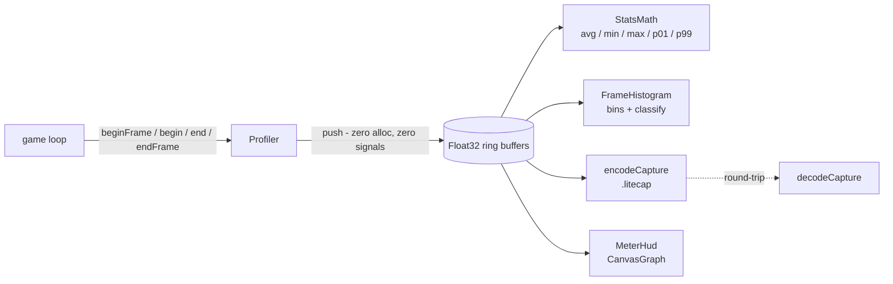
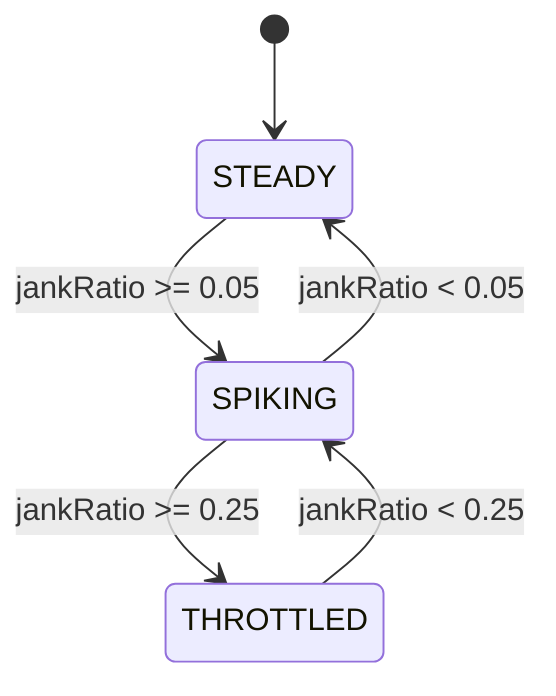

# @zakkster/lite-profiler

[](https://www.npmjs.com/package/@zakkster/lite-profiler)
[](https://github.com/sponsors/PeshoVurtoleta)
[](https://bundlephobia.com/result?p=@zakkster/lite-profiler)
[](https://www.npmjs.com/package/@zakkster/lite-profiler)
[](https://www.npmjs.com/package/@zakkster/lite-profiler)


[](https://opensource.org/licenses/MIT)

Always-on frame and per-phase profiling for HTML5 game loops. `performance.now()` into power-of-two ring buffers, single-pass percentiles, a frame-time classifier that tells a GC spike apart from a sustained throttle, deterministic per-frame command counters that gate exactly, and a binary capture format you can serialize, ship, and read back.

**The in-engine profiler stats.js doesn't have and DevTools can't keep running.**

> The core is the engine-agnostic, zero-GC capture surface. **1.1.0** added capture comparison + regression gating; **1.2.0** added deterministic per-frame counters. The reactive `lite-signal` bridge, the `lite-scheduler` / `lite-ecs` adapters, and a GPU HUD are companion packages built on this surface (see [Roadmap](#roadmap)).

## Why lite-profiler?

| Capability | lite-profiler | stats.js | DevTools Performance | Phaser built-in | hand-rolled |
|---|---|---|---|---|---|
| **Per-phase (named sub-frame) timing** | **Yes** | No | Manual (User Timing) | No | Manual |
| **Zero-GC hot path** | **Yes** | No | n/a | Partial | Depends |
| **Percentile stats (p50 / p99)** | **Yes** | No | Manual | No | Manual |
| **GC-spike vs throttle classifier** | **Yes** | No | No | No | No |
| **Shareable binary capture + reader** | **Yes (`.litecap`)** | No | Partial (JSON) | No | No |
| **Headless capture (no DOM)** | **Yes** | No | n/a | No | Yes |
| **Worker / OffscreenCanvas HUD** | **Yes** | No | n/a | No | Manual |
| **Framework-agnostic** | **Yes** | Yes | Yes | No (Phaser only) | Yes |
| **TypeScript declarations** | **Yes** | Partial | n/a | Yes | n/a |
| **Reactive (signal) surface** | **Via bridge** | No | No | No | No |

> Chrome DevTools' Performance panel is the right tool for a deep, one-off flame-graph investigation with full call stacks. lite-profiler is for the other job: telemetry that runs every frame, in production, that you can classify and serialize. Different tools, different moments.

## Installation

```bash
npm install @zakkster/lite-profiler
```

ESM only. Requires `@zakkster/lite-ring-buffer`, `@zakkster/lite-stats-math`, and `@zakkster/lite-canvas-graph` at `>= 1.0.1` (the patch that fixes their package `exports` for strict Node ESM resolution). npm pulls them automatically.

## Architecture at a Glance

The hot path is imperative and allocation-free: it does nothing but push `performance.now()` deltas into pre-allocated ring buffers. Everything that reasons about the data — percentiles, the histogram, capture export, the HUD — runs off the hot path, reading from those buffers on your schedule.


```mermaid
flowchart LR
  L[game loop] -->|beginFrame / begin / end / endFrame| P[Profiler]
  P -->|push - zero alloc, zero signals| R[(Float32 ring buffers)]
  R --> S[StatsMath<br/>avg / min / max / p01 / p99]
  R --> H[FrameHistogram<br/>bins + classify]
  R --> C[encodeCapture<br/>.litecap]
  C -.->|round-trip| D[decodeCapture]
  R --> U[MeterHud<br/>CanvasGraph]
```

## Quick Start

```js
import { Profiler, FrameHistogram, FrameClass } from '@zakkster/lite-profiler';

const profiler = new Profiler(1024, ['input', 'physics', 'render']);
const hist = new FrameHistogram();

function frame() {
  profiler.beginFrame();

  profiler.begin('input');    /* read input */    profiler.end('input');
  profiler.begin('physics');  /* step world */    profiler.end('physics');
  profiler.begin('render');   /* draw */          profiler.end('render');

  profiler.endFrame();
  requestAnimationFrame(frame);
}
requestAnimationFrame(frame);

// Off the hot path (a timer, every N frames, a devtools panel):
hist.update(profiler.frame);
if (hist.classify() === FrameClass.SPIKING) {
  console.warn('intermittent hitches, spikeRatio =', hist.spikeRatio.toFixed(3));
}
```

## Live dashboard demo

`demo/index.html` is a single-file diagnostic dashboard in the oscilloscope theme: a boids flock instrumented across four phases (`spatial`, `steer`, `integrate`, `render`) with the full telemetry surface beside it — the classifier verdict, fps, p50 / p99, a per-phase breakdown, and a live frame-time histogram. Drag the boid count up until frames stay over budget (watch it turn **THROTTLED**); hit **inject GC** to scatter sparse hitches while the phase bars stay calm (**SPIKING** — a pause your code didn't cause). Export the session to `.litecap` from the toolbar.

```bash
npm install     # the demo loads the deps from node_modules through an import map
npx serve .     # then open http://localhost:3000/demo/
```

## The reactive-profiler trap

A profiler measures the hot path, so it must never *be* a cost on the hot path. The trap is the obvious-but-wrong move: writing a signal (or firing a callback) on every `begin`/`end`. At a few hundred phase boundaries per frame that is allocation and propagation churn inside the very loop you are trying to measure — your profiler shows the overhead of your profiler.

The core sidesteps it structurally: `begin`/`end`/`beginAt`/`endAt` only write a `float32` into a fixed ring buffer — no allocation, no callbacks, no reactivity. The reactive surface (the `lite-signal` bridge package) follows the same rule the `lite-ws` transport does: the hot path stays silent, and a single rAF-aligned pulse lifts *coarse summaries* (fps, `frameMs.p99`, per-phase rollups) into signals about ten times a second. The capture buffers stay flat; only the summary signals move.

## Frame Classifier

`FrameHistogram` buckets frame times on a log-ish scale and then labels the *shape* of the distribution. Two high-latency signatures look very different in the buckets:

- **Sparse spikes** — most frames are on budget, a few land in the `33-66` / `>=66` ms buckets. Classic GC pause / occasional hitch.
- **Sustained elevation** — a large share of frames sit just above budget in the `16-33` ms bucket. CPU-bound, thermal throttle, or a background tab.

Buckets (ms): `[0] <2` `[1] 2-4` `[2] 4-8` `[3] 8-16` `[4] 16-33` `[5] 33-66` `[6] >=66`. The `16` and `33` ms edges are the 60fps and 30fps budgets.

`classify()` is a deliberately simple, documented heuristic over two ratios (`jankRatio` = fraction `>= 16ms`, `spikeRatio` = fraction `>= 33ms`). It is a label, not a verdict — the raw `bins`, `jankRatio`, and `spikeRatio` are all exposed so you can write your own rule.


```mermaid
stateDiagram-v2
  [*] --> STEADY
  STEADY --> SPIKING: jankRatio >= 0.05
  SPIKING --> THROTTLED: jankRatio >= 0.25
  THROTTLED --> SPIKING: jankRatio < 0.25
  SPIKING --> STEADY: jankRatio < 0.05
```

## Deterministic counters

Timing is noisy, so you gate it by *tolerance*. Command counts are not: the draw calls a frame issued, or the floats it uploaded, are integers your code already has at frame end — identical on every host and run. They gate at **zero tolerance, exactly**, in CI, with no median-of-N and no GPU.

Counters register as an optional third argument and use the same `handle` / `At` hot-path idiom as phases (no per-call string hashing); each flushes one value per `endFrame()`:

```js
const p = new Profiler(1024, ['sim', 'draw'], ['drawCalls', 'floatsUploaded']);
const UP = p.counterHandle('floatsUploaded');
// per frame:
p.count('drawCalls');          // by tag
p.countAt(UP, batch.floats);   // by handle (hot path)
```

`summarize()` reports a `counters` block — `{ [tag]: { sum, avg, min, max, p01, p99, last, count } }`, with `sum` an exact integer total — and the counts that must not drift gate at zero:

```js
assertNoRegression(baseline, candidate, {
  'counter.floatsUploaded.max': 0,   // dirty-range guard: a one-instance change must not re-upload the buffer
  'counter.drawCalls.max': 0         // batching guard: the draw-call count must not climb
});
```

A counter the baseline tracked that the candidate stops reporting is a **regression** (`reason: 'metric missing in candidate'`) — a gate that can't see the metric it guards must fail, not pass. Per-frame values are exact to `2^24` (Float32 rings); `sum` is an exact Float64 total beyond that. This is the seam a GPU render layer emits into: `recordDraw` / `recordUpload` become `count` calls that gate headlessly alongside timing.

## Full Module Reference

### `Profiler` — capture core
Zero-GC frame and per-phase timing. Phases are registered once at construction; the hot path allocates nothing.

| Member | Description |
|---|---|
| `new Profiler(capacity?, phases?, counters?)` | `capacity` rounds up to a power of two (e.g. `600 -> 1024`); `phases` and the optional `counters` are string tag arrays. |
| `beginFrame()` / `endFrame()` | Bracket a frame; `endFrame` records total frame time and flushes counter accumulators. |
| `begin(tag)` / `end(tag)` | Time a phase by tag. No-op for unknown tags. |
| `beginAt(handle)` / `endAt(handle)` | Hot-path form using an integer handle — no string hashing per call. |
| `handle(tag)` / `tagOf(handle)` | Resolve a tag to a stable handle (`-1` if unknown) and back. |
| `frame` / `phase(tag)` / `phaseAt(handle)` | The underlying `RingBuffer`s for stats, histogram, export. |
| `phaseCount` / `capacity` | Counts and the resolved buffer capacity. |
| `count(tag, n?)` / `countAt(handle, n?)` | Add to a counter for the current frame (accumulates; flushed on `endFrame`). The `At` form skips per-call string hashing. |
| `counterHandle(tag)` / `counterTagOf(handle)` | Resolve a counter tag to a stable handle (`-1` if unknown) and back. |
| `counter(tag)` / `counterAt(handle)` / `counterCount` | The counter `RingBuffer`s and their count. |
| `reset()` / `destroy()` | Clear buffers / release them. |

### `FrameHistogram` — distribution + classifier
`update(buffer)` (zero-alloc, reuses `bins`), `bins: Uint32Array(7)`, `total`, `modeIndex`, `jankRatio`, `spikeRatio`, `classify(): FrameClass`. `FrameClass = { STEADY, SPIKING, THROTTLED }`.

### `TimelineRecorder` — absolute-time capture (flame-chart prerequisite)

Opt-in, independent of `Profiler`. `recordFrameBoundary(t?)`, `beginSpan`/`endSpan` (+ `…At(handle)`), `mark(tag,t?)`; accessors `frameBoundaries`, `spanT0`/`spanT1`, `instantTime`. Own `Float64Array` rings so absolute timestamps survive hour-scale sessions. See [Timeline capture](#timeline-capture-flame-chart-prerequisite).

### `encodeCapture` / `decodeCapture` / `encodeTimelineCapture` — `.litecap` binary IO
`encodeCapture(profiler, scratch?, meta?) -> ArrayBuffer | null` (pass a reusable `Float32Array` scratchpad to avoid allocation; `meta` is optional JSON-serializable provenance such as `{ engine, label }`; returns `null` if no frames). `decodeCapture(arrayBufferOrView) -> { version, count, numPhases, frames, phases, tags, meta, counters, counterTags }` — validates magic, version, and byte length before reading (a v3 capture carries counter data; v1/v2 decode with `counters: []`). `downloadCapture(buffer, filename?)` for browsers. `LITECAP` exposes the format constants.

### `FrameBudget` / `budgetMs` / `isOverBudget` — budgets
`FrameBudget.{FPS_30, FPS_60, FPS_120}` in ms, `budgetMs(targetFps)`, `isOverBudget(frameMs, targetFps)`.

### `MeterHud` — CPU overlay
`new MeterHud(canvas, profiler, options?)`, `render()`, `resize(w, h)`, `setMaxMs(ms)`, `destroy()`. Renders the frame-time envelope via `lite-canvas-graph` with a small ms/fps readout. Worker / `OffscreenCanvas` friendly via the `dpr` option.

### `summarize` / `diffCaptures` / `checkRegression` / `assertNoRegression` — comparison
`summarize(profiler, meta?) -> CaptureSummary` reduces a window to a small JSON-serializable object (frame `avg/min/max/p01/p99/fps`, `jankRatio`, `spikeRatio`, `frameClass`, histogram `bins`, per-phase stats, and a per-counter block `{ [tag]: { sum, avg, min, max, p01, p99, last, count } }`) tagged with optional `{ label, engine, budgetMs }`. `summarizeCapture(decoded, meta?)` does the same from a decoded `.litecap`. `diffCaptures(baseline, candidate)` returns per-metric `{ base, cand, delta, pct }`. `checkRegression(baseline, candidate, tolerances?)` returns `{ ok, regressions, diff }`; `assertNoRegression(...)` throws a `RegressionError` (carrying `err.report`) when a gated metric worsens beyond tolerance. `DEFAULT_TOLERANCES` gates `frame.avg` and `frame.p99` at `+10%`.

### `exportChromeTrace` / `litecap` CLI — trace export + terminal tooling
`exportChromeTrace(decoded, opts?) -> ChromeTrace` converts a decoded LiteCap **v4** timeline into a Chrome Trace Event object for Perfetto; `opts` is `{ normalize?, processName? }`. Throws on a v2/v3 capture (no absolute clock). The `litecap` CLI (`npx litecap`) wraps `inspect` / `summarize` / `diff` / `gate` / `trace` with the family exit-code contract (`0/1/2/3`). See [Chrome trace export & the `litecap` CLI](#chrome-trace-export--the-litecap-cli).

### `createFrameProbe` — SPP frame-telemetry probe
`createFrameProbe({ profiler, sink, streamId?, clock?, regressed? }) -> { sample(), dispose(), disposed }` emits the frozen SPP `0x0410–0x0415` frame-telemetry block (`FRAME_TELEMETRY_DESCRIPTOR`) into a DI'd sink, giving the standalone `Profiler` a `@zakkster/lite-scope` channel with no reactive dependency. Zero-GC. See [Scope probe (`createFrameProbe`)](#scope-probe-createframeprobe).

### `createPhaseProbe` — SPP phase-telemetry probe
`createPhaseProbe({ profiler, sink, streamId?, clock?, intern? }) -> { sample(), dispose(), disposed }` is the per-phase sibling: each `sample()` reduces every registered phase ring to avg / p99 / max and emits them on the frozen SPP block `0x0900–0x0902` (`PHASE_TELEMETRY_DESCRIPTOR`), one `phase-telemetry` stream, with the phase's tag id in the record's `b` slot. Zero-GC. See [Phase probe (`createPhaseProbe`)](#phase-probe-createphaseprobe).

## The `.litecap` format

A flat little-endian buffer. Frames and each phase are stored oldest-first.

| Offset | Type | Field | Notes |
|---|---|---|---|
| `0` | `uint8[4]` | magic | `'L' 'C' 'A' 'P'` |
| `4` | `uint8` | version | `1`, `2`, `3`, or `4` |
| `5` | `uint32` LE | count | samples per buffer |
| `9` | `uint8` | phases | number of phase buffers |
| `10` | `float32[count]` LE | frames | total frame times |
| `10 + 4*count` | `float32[count]` LE | phase *p* | repeated for `p = 0 .. phases-1` |

Total size is `10 + (count * 4) + (phases * count * 4)` bytes for v1. **v2** appends a self-describing trailer after the float data: each phase tag as a `uint8` length + UTF-8 bytes (registration order), then a `uint32` length + UTF-8 JSON metadata blob. **v3** appends one more trailer after the meta blob when counters are present: a `uint8` counter count, each counter's `count` float32 samples (oldest-first), then each counter tag. A capture with no counters still emits **v2**, so older readers decode it unchanged. **v4** appends a timeline trailer after the counter section when a `TimelineRecorder` with data is serialized: the absolute frame boundaries, then each span lane (`tag`, pair count, `t0[]`, `t1[]`) and each instant lane (`tag`, mark count, `times[]`), all `float64`. `decodeCapture` bounds-checks every trailer read and still decodes v1–v3 buffers (returning `tags: []` / `counters: []` / `frameBoundaries: null`, `meta: null`), so older captures keep working with no consumer changes.

**Version discipline.** Emit is the lowest version that fits: v2 (no counters, no timeline), v3 (counters), v4 (timeline with data). A timeline-free capture is **byte-identical** to a v2/v3 one — older readers are unaffected. Absolute timestamps are `float64` by necessity: a session open for hours pushes `performance.now()` past the point where a `float32` ULP exceeds a millisecond, so a `float32` span start would be quantized away.

## Timeline capture (flame-chart prerequisite)

The core `Profiler` stores **durations** — `now - start` per phase. Durations alone can't reconstruct a flame chart: you also need to know **when** each span began on a shared clock. `TimelineRecorder` captures that missing axis.

```js
import { TimelineRecorder, encodeCapture } from '@zakkster/lite-profiler';

// Opt-in, independent of Profiler. Register span + instant lanes once.
const tl = new TimelineRecorder(1024, ['physics', 'render'], ['gc']);

function frame() {
  tl.recordFrameBoundary();               // absolute frame start

  tl.beginSpan('physics'); step(); tl.endSpan('physics');
  tl.beginSpan('render');  draw(); tl.endSpan('render');

  if (collectedGarbage) tl.mark('gc');    // instant event
}

// Serialize alongside the profiler → LiteCap v4 (durations + absolute time in one file).
const buf = encodeCapture(profiler, scratch, { label: 'session' }, tl);
```

It's a separate object from `Profiler` — use it standalone (`encodeTimelineCapture(tl)`) or pass it as the fourth argument to `encodeCapture`. The hot path allocates nothing; samples land in preallocated rings.

**Why its own rings.** `TimelineRecorder` uses raw `Float64Array` rings rather than the shared `RingBuffer`, which is `Float32`. That's correct for small duration deltas but fatal for *absolute* time — an hour into a session, `performance.now()` is large enough that a `float32` ULP exceeds a millisecond, so a sub-ms span start would be silently quantized away. (This is the same reason `Profiler` keeps its phase *start* timestamps in a `Float64Array`.)

Reading back:

```js
const cap = decodeCapture(buf);
// cap.frameBoundaries : Float64Array of absolute frame starts
// cap.spanTags[i], cap.spanT0[i], cap.spanT1[i] : lane i's absolute t0/t1 pairs
// cap.instantTags[i], cap.instantTimes[i]       : lane i's absolute marks
const durations = cap.spanT1[0].map((t1, k) => t1 - cap.spanT0[0][k]);
```

## Chrome trace export & the `litecap` CLI

A v4 capture carries an absolute clock, so it can be turned into a **flame chart** with no bespoke viewer. `exportChromeTrace(decoded)` produces the [Chrome Trace Event](https://ui.perfetto.dev) object that Perfetto and `chrome://tracing` load directly:

```js
import { decodeCapture, exportChromeTrace } from '@zakkster/lite-profiler';

const trace = exportChromeTrace(decodeCapture(buf));   // { traceEvents, displayTimeUnit, metadata }
// drop JSON.stringify(trace) onto ui.perfetto.dev
```

Span pairs become `X` (complete) events, instant marks `i` events, and frame boundaries a marker lane; each lane is its own thread. Timestamps scale `performance.now()` ms to Chrome's microseconds — absolute by default, or `{ normalize: true }` to zero-base. It **refuses a v2/v3 capture** (a capture with no timeline): durations without a start clock can't make an honest flame chart, and inventing one would be a lie in a diagnostic tool.

The same surface ships as a CLI for CI and quick terminal checks — `npx litecap`:

```bash
litecap inspect   session.litecap                 # structural header dump
litecap summarize session.litecap --format json   # CaptureSummary
litecap diff      base.litecap cand.litecap        # per-metric deltas
litecap gate      base.litecap cand.litecap        # regression gate (exit 0/1/2)
litecap trace     session.litecap -o trace.json    # Chrome trace for Perfetto
```

The grammar mirrors `lite-gc-gate` on purpose — verb-first, `--format console|json|markdown|github`, `--json <path>`, `--config <path>` — and shares its **exit-code contract: `0` pass, `1` fail, `2` inconclusive, `3` infrastructure error.** `gate` is a true three-state verdict: an empty capture, a schema mismatch, or a tolerance metric absent from both captures is **inconclusive (exit 2)**, never a silent pass — the same discipline that keeps "did not measure" distinct from "passed" everywhere in the family. Every verdict delegates to the in-process API (`summarizeCapture` / `diffCaptures` / `checkRegression`), pinned equal by a test, so the CLI can never become a second implementation.

> Note: the committed `test/fixtures/trace-sample.json` and the trace-event schema assertions cover the exporter in CI; loading a trace into the live Perfetto UI is a manual verification step.

## Scope probe (`createFrameProbe`)

The `@zakkster` profiler suite shares one wire format — the **Scope Probe Protocol (SPP)**, frozen in [`@zakkster/lite-scope`](https://www.npmjs.com/package/@zakkster/lite-scope): every probe emits fixed-width records into an injected sink, and no probe imports another package. `createFrameProbe` gives the standalone `Profiler` its SPP channel, so a plain, **non-reactive** profiler shows up on the Scope alongside GC, layout, worker and leak probes:

```js
import { Profiler, createFrameProbe } from '@zakkster/lite-profiler';

const probe = createFrameProbe({ profiler, sink, streamId: 4 });
// on your cadence (the descriptor advertises 10 Hz):
probe.sample();   // emits 6 records: fps, frame.avg, frame.p99, frame.max, jank, frame.class
```

Each `sample()` reduces the frame window and writes six records into the DI'd `sink` (`write(packed, t, a, b)`, `packed = streamId<<16 | opcode`) — reusing the **frozen `0x0410–0x0415` frame-telemetry block** so a core-profiler stream drops onto the existing Scope CHANNELS scene and gate with no protocol change. It's **zero-GC**: the `StatsMath` + `FrameHistogram` scratch is allocated once and reused, so a sample allocates nothing (proven under `--expose-gc`).

This is the **direct** path to the Scope. The same telemetry was previously reachable only through the reactive bridge (`lite-profiler-signal` + a `lite-signal` peer + `lite-throttle` + `lite-watch-ex`); `createFrameProbe` needs nothing but this package and a sink — for headless, CI, and non-reactive apps. It's a second *producer* of a shared channel, not a new block: run one probe or the other, never both for the same profiler.

> **Conformance (v1.5.1).** The probe's records are verified end to end against a real `@zakkster/lite-scope`: `test/14-scope-conformance.test.js` registers the descriptor through the actual registry, writes into a real memory sink, and decodes the bytes back through lite-scope's own `readSlab` reference decoder — proving the registry-assigned stream id is the one on the wire and every decoded value exactly equals `summarize()`. `src/probe.js` still imports nothing from lite-scope (it is a test-only devDependency); probes couple by protocol, never by dependency.

## Phase probe (`createPhaseProbe`)

`createFrameProbe` streams the whole-frame numbers; **`createPhaseProbe` streams the per-phase breakdown** on the same Scope. It reduces every registered phase ring (`physics`, `render`, …) to avg / p99 / max and emits them on the **frozen SPP block `0x0900–0x0902`** (`PHASE_TELEMETRY_DESCRIPTOR`) — a dedicated block owned by `@zakkster/lite-scope` 1.1.0, produced only here:

```js
import { Profiler, createPhaseProbe } from '@zakkster/lite-profiler';

const profiler = new Profiler(1024, ['physics', 'render']);
// … begin(tag)/end(tag) each frame …

const probe = createPhaseProbe({ profiler, sink, streamId: 6 });
// on your cadence (the descriptor advertises 10 Hz):
probe.sample();   // emits 3 records per phase: phase.avg, phase.p99, phase.max
```

A single `phase-telemetry` stream carries every phase: the phase's **tag id rides the record's `b` slot**, so one stream demuxes into as many lanes as you have phases. By default `b` is the profiler's own dense phase index (`profiler.handle(tag)` order); pass `intern` (a `scope.intern` bridge) to carry scope-interned ids resolvable via the scope's string table. Interning happens once, at construction — the hot path never interns.

It's **zero-GC**: the `StatsMath` scratch, the reused `out` object, and the per-phase tag-id table are allocated once and reused, so a sample allocates nothing (proven under `--expose-gc`). A profiler with no registered phases emits nothing. Every emitted value exactly equals `summarize().phases[tag].{avg,p99,max}` — one source of truth.

> **Conformance (v1.6.0).** `test/16-phase-scope-conformance.test.js` registers `PHASE_TELEMETRY_DESCRIPTOR` through a real `createScope`, writes into a real memory sink, and decodes back through lite-scope's `readSlab` — proving block-0x09 stream routing and width-1 records, that each `b` resolves to its tag via the scope string table, and that the decoded avg/p99/max still exactly equal `summarize()`. `src/phase-probe.js` imports nothing from lite-scope (test-only devDependency); couple by protocol, never by dependency.

## Capture comparison & regression gating

`summarize()` turns a rolling window into a small, self-describing snapshot; comparing two snapshots is how you prove a change did not cost performance. Because the profiler is engine-agnostic, the same workload can be captured under different builds and diffed — which is exactly how this pairs with the reactive stack: profile one graph under lite-signal 1.3.0, again under 1.4.0 (and later 1.7.0), and gate on the delta. A conformance suite says the engine is *still correct*; this says it is *still fast*.

```js
import { summarize, assertNoRegression } from '@zakkster/lite-profiler';

// baseline: profile the workload on the current engine, save the summary as JSON
const baseline = summarize(profiler, { label: 'fan-out-1k', engine: 'lite-signal@1.3.0' });
// fs.writeFileSync('baseline.json', JSON.stringify(baseline));

// candidate: the same workload on the next engine
const candidate = summarize(profiler2, { label: 'fan-out-1k', engine: 'lite-signal@1.4.0-beta.1' });

// gate: throws RegressionError if a gated metric regressed beyond tolerance
assertNoRegression(baseline, candidate, {
  'frame.avg': 0.10,
  'frame.p99': 0.10,
  'phase.render.p99': 0.15
});
```

The summary is plain JSON, so a baseline is git-diffable and lives next to the test. `checkRegression()` is the non-throwing form when you want to report rather than fail. `fps` is higher-is-better and gated in the opposite direction automatically; counters are lower-is-better. Metric paths are `frame.<metric>`, `phase.<tag>.<metric>`, or `counter.<tag>.<metric>` (see [Deterministic counters](#deterministic-counters)).

## Recipes

**Hot-path handles (skip string hashing in the loop)**
```js
const PHYS = profiler.handle('physics');
const DRAW = profiler.handle('render');
// per frame:
profiler.beginAt(PHYS); step(); profiler.endAt(PHYS);
profiler.beginAt(DRAW); draw(); profiler.endAt(DRAW);
```

**Percentiles for a phase**
```js
import { StatsMath } from '@zakkster/lite-stats-math';
const stats = new StatsMath(profiler.capacity);
const out = { avg: 0, min: 0, max: 0, p01: 0, p99: 0 };
stats.compute(profiler.phase('render'), out);
console.log('render p99 =', out.p99.toFixed(2), 'ms');
```

**Capture, share, read back**
```js
import { encodeCapture, decodeCapture, downloadCapture } from '@zakkster/lite-profiler';
const scratch = new Float32Array(profiler.capacity); // reuse across captures, no per-call alloc
const buf = encodeCapture(profiler, scratch, { engine: 'lite-signal@1.4.0', label: 'session' });
if (buf) downloadCapture(buf, 'session.litecap');
// in an analysis tool later (v2 captures also carry tags + meta):
const { frames, phases, tags, meta } = decodeCapture(buf);
```

**Live overlay**
```js
import { MeterHud } from '@zakkster/lite-profiler';
const hud = new MeterHud(document.querySelector('#meter'), profiler, { maxMs: 33 });
// after endFrame():
hud.render();
```

## Roadmap

This package is the focused core. Each layer below ships separately so the core stays dependency-light and signal-free:

- **`lite-profiler-signal`** — the reactive boundary (mirrors `lite-camera` -> `lite-camera-max`): coarse telemetry as signals via a rAF-aligned `lite-throttle` pulse, plus `lite-watch-ex` predicate / rolling-history watchers for `onJank` and per-phase regression alerts.
- **`lite-profiler-scheduler`** *(headline adapter)* — profile `lite-scheduler` priority lanes: budget used vs allotted, overruns, per-lane percentiles. No private-field access; it rides the scheduler's public surface.
- **`lite-profiler-ecs`** — a documented adapter for `lite-ecs` system timing.
- **`lite-profiler-gl`** — a `lite-gl` HUD backend rendering thousands of frames across many phases in a single instanced draw.
- **Diagnostic dashboard** — a live showcase profiling a real workload (a `lite-soa-particle-engine` / `lite-fx` storm), with `lite-hotkey` to toggle the overlay.

Capture comparison and regression gating (`summarize` / `diffCaptures` / `assertNoRegression`) landed in the core in 1.1.0; deterministic per-frame counters (`count` / `countAt`, `counter.<tag>.<metric>` gating, LiteCap v3) landed in 1.2.0. The timeline-capture layer that a flame chart needs landed in 1.3.0: `TimelineRecorder` records absolute `performance.now()` span pairs, frame boundaries, and instant marks (LiteCap v4). The Perfetto / Chrome-trace exporter (`exportChromeTrace`) and the `litecap` CLI landed in 1.4.0 — a formatting shim and a terminal front-end over that data model, adding no new format.

## Testing

```bash
npm test             # node --test (138 tests)
npm run bundle-check # esbuild ESM bundle sanity check
```

`prepublishOnly` runs both. The suite uses the native `node:test` runner with no test-framework dependency. The hot path's zero-allocation property is a design contract (fixed-size typed-array ring buffers, no per-frame object creation); the suite verifies the capture window never grows past `capacity`, that buffers are reused across updates, and that absolute phase timestamps keep sub-millisecond precision at long-uptime `performance.now()` values.

## License

MIT (c) 2026 Zahary Shinikchiev. See [LICENSE.txt](./LICENSE.txt) and [CHANGELOG.md](./CHANGELOG.md).
